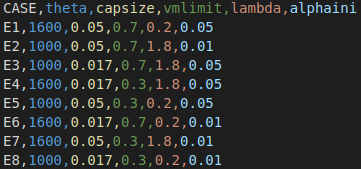

### CSV FILE STRUCTURE
This file contains the characteristics of the cases that want to be run. The total of runs depends on the user and several parameters can be specified for each case, for the non-specified parameters the default value are taken. The default values can be seen in [runall.py](../../runall.py).

Example of a .csv file for eight cases in which 5 parameters are specified:

    CASE,theta,capsize,vmlimit,lambda,alphaini
    E1,1600,0.05,0.7,0.2,0.05
    E2,1000,0.05,0.7,1.8,0.01
    E3,1000,0.017,0.7,1.8,0.05
    E4,1600,0.017,0.3,1.8,0.05
    E5,1000,0.05,0.3,0.2,0.05
    E6,1600,0.017,0.7,0.2,0.01
    E7,1600,0.05,0.3,1.8,0.01
    E8,1000,0.017,0.3,0.2,0.01

**NOTE:** The parameter 'CASE' should **always** be included.