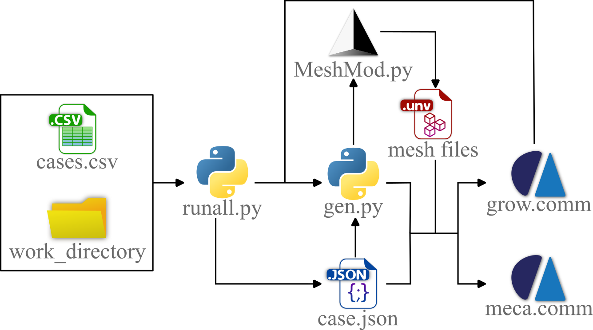

# BioDesign - script for morphogenesis-inspired design

This project was developed at Aix Marseille Univ, CNRS, ISM, Marseille, France. [CBI](https://ism-cbi.duckdns.org/), and was supported by French Research National Agency (ANR) Grant No. ANR-20-CE10-0008.

This repository contains the implementation of a bio-inspired algorithm for the design of unilateral contact surfaces based on the morphogenesis of synovial joint principles. It is meant to be used with  [CODE_ASTER 14.4](https://code-aster.org/), [GMSH 4.9.3](https://gmsh.info/doc/texinfo/gmsh.html), and [Paraview 5.9](https://www.paraview.org/) (for result visualization).

This Python module was created by Kalenia MARQUEZ-FLOREZ. It allows obtaining a bio-inspired contact surface profile for two axi-symmetric bodies in unilateral contact.

## Requisites

    Python 3.x
    Salome-Meca 2019 (and all its prerequisites)
    Code_Aster 14.4 
    Gmsh 4.9.3
    Paraview 4.9

Python libraries used: matplotlib, json, csv, numpy, math, psutil, logging, os, subprocess, shutil, sys

## General instructions
The main python file to run the script is [runall.py](runall.py) which has as input the path of the cases .csv file (see [example README](/Docs/Example/README.md)) and the path of the work_directory (where all the results of the simulations are stored). Then, the [runall.py](runall.py) script calls the [gen.py](gen.py) which is the general script that manages the whole process. It is [gen.py](gen.py) which calls the [mesh module](Pyfile/MeshMod.py) (supported in GMSH) to generate the .unv meshes for the simulations and each of the CODE_ASTER command files ([for morphogenesis](GrowNO.comm) and [to monitor contact variables](mecaNO.comm), *i.e*. stresses). At each growth step, the results are written in format .vtk by the module [resVTK.py](Pyfile/resVTK.py).

Use:
    
    import runall from runall

    runall('csv_file_path', 'work_directory_file_path')

**NOTE**: Change the CODE_ASTER path in [mecaNO.comm](mecaNO.comm), [growNO.comm](growNO.comm) and [gen.py](gen.py) accordingly to your system

## Research
The scripts of this repository were first used in [XXXX](xxxx)
